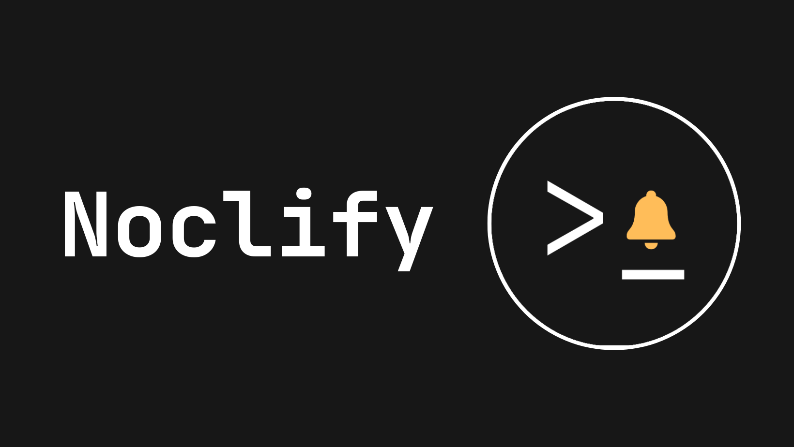

<p align="center">
  
</p>

__Get notified by a Telegram bot when a task executed in your terminal finishes.__

Useful if you usually run long tasks and you like to do something else in the meantime.

## How to use
1. Install the CLI
```
npm i -g noclify
```

2. Start a conversation with the [Telegram bot](t.me/noclify_bot). It'll return a key like this one: `14237999-334a-4429-4444-e4c323c37440`
3. Run whatever command you want preceded by `noclify` in your shell, for example:
```
noclify sleep 5
```
4. Paste the key and you are all set (it won't ask for the key in subsequent runs)
5. Check that you have been notified of the task ending succesfully:
```
✅ sleep 5 ended successfully (5.011s)
```
## How it works
There are three pieces working together here:
1. Telegram's bot API
2. Cloudflare worker (whose code is under the `worker` folder)
3. CLI (whose code is under the `cli` folder and published in NPM)

When you use the bot the first time it generates a key for you that saves together with your chat id in Cloudflare Worker KV.

The CLI executes whatever command you put after `noclify` and when it ends notifies the worker with your key and some metadata. __Note: If the task lasts less than 4 seconds it won't notify anything, because you are probably there anyway.__ 

The worker finds your chat id given the key and sends the message to the Telegram API.


